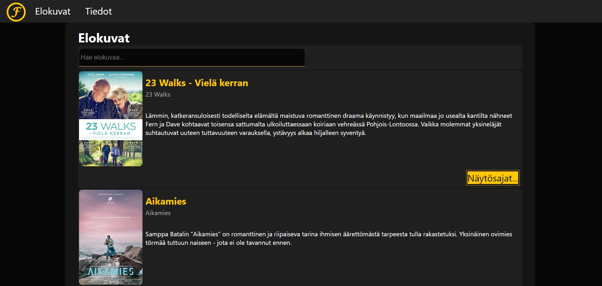
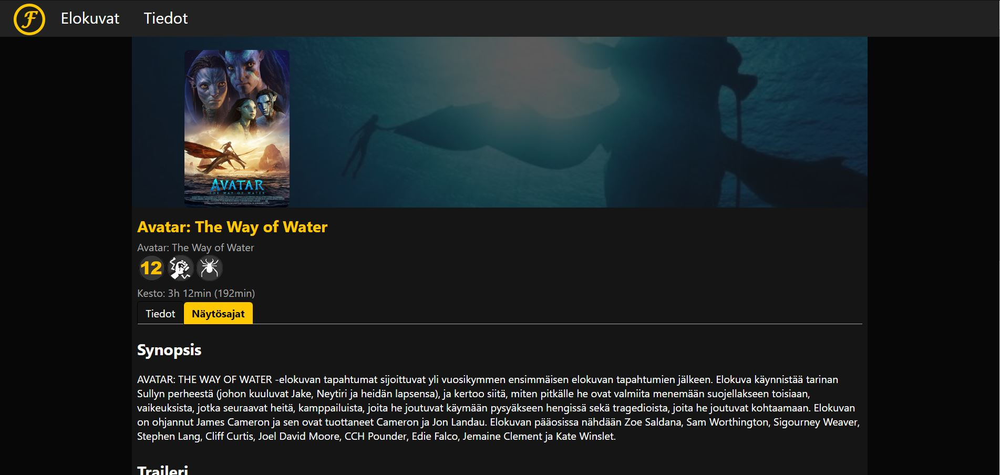
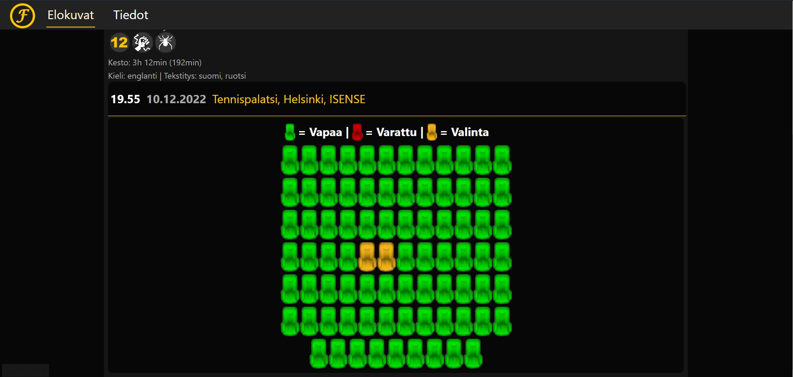

# Finnkino App
Ensimmäinen React App projekti. Projektissa ideana oli luoda pieni klooni versio Finnkinon sivuista, jossa pystyy katsomaan jo ohjelmistossa olevien elokuvien tietoja ja mahdollisesti "varaamaan" paikkoja.

Kaikkia ominaisuuksia ja ideoita ei tullut toteutettua, koska projektissa pääidea kuitenkin oli vain opetella itsenäisesti Reactia.

## Demo
Linkki demoon: [https://users.metropolia.fi/~leevikos/finnkinoapp](https://users.metropolia.fi/~leevikos/finnkinoapp)

### API:
- [Finnkino XML services](https://www.finnkino.fi/xml/)

### Käytettyjä kirjastoja:
- [React](https://github.com/facebook/react) by [Facebook/Meta](https://github.com/facebook)
- [React Router](https://github.com/remix-run/react-router) by [Remix](https://github.com/remix-run)
- [React Tabs](https://github.com/reactjs/react-tabs) by [ReactJS](https://github.com/reactjs)

### IDE - Ohjelmointiympäristö:
- [WebStorm](https://www.jetbrains.com/webstorm/)

### Kuvakaapauksia:

